# 🛡️ DISA STIG Windows 11 Remediation Portfolio

This project demonstrates the identification, remediation, and verification of Windows 11 DISA STIG findings using **Tenable Vulnerability Management** and **PowerShell**.

The objective was to identify security configuration findings, remediate them using PowerShell, and validate successful remediation through follow-up vulnerability scans.

---

## 🔄 Remediation Workflow

**Tenable Scan ❌ Failed → PowerShell Remediation → Tenable Rescan → ✅ Passed**

Each remediation script includes the STIG ID, remediation code, testing information, usage instructions, and applicable documentation.

---

# STIG Remediations

## 1. WN11-AU-000500 — Application Event Log Size

**Rule:**  
The Windows Application event log must be configured with a maximum size of at least **32768 KB (32 MB)**.

**Why It Matters:**  
Adequate event log capacity helps preserve security and audit events used for monitoring and incident investigation.

**Remediation:** PowerShell

### ❌ Initial Scan — Failed

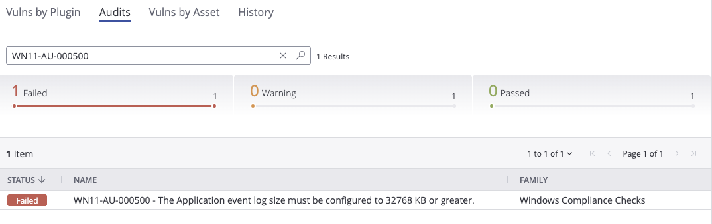

### ✅ Verification Scan — Passed

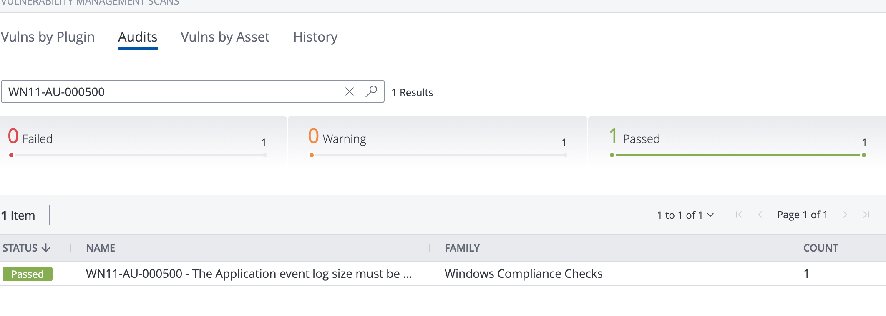

**Result:** ✅ Remediated & Verified

🔧 [View PowerShell Remediation Script](scripts/WN11-AU-000500.ps1)

---

## 2. WN11-CC-000326 — PowerShell Script Block Logging

**Rule:**  
Windows PowerShell Script Block Logging must be enabled.

**Why It Matters:**  
Script Block Logging records PowerShell activity and provides valuable visibility for detecting, investigating, and responding to potentially malicious PowerShell execution.

**Remediation:** PowerShell

### ❌ Initial Scan — Failed

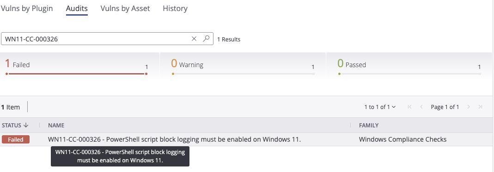

### ✅ Verification Scan — Passed

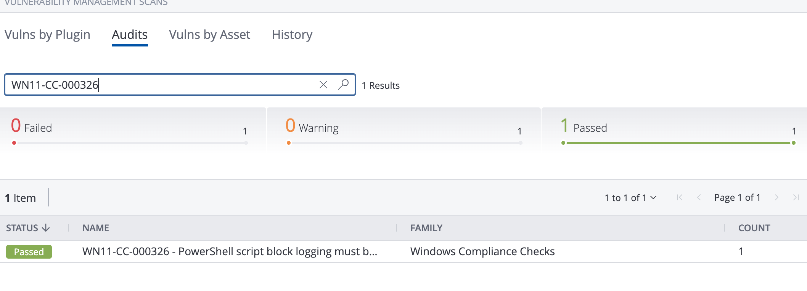

**Result:** ✅ Remediated & Verified

🔧 [View PowerShell Remediation Script](scripts/WN11-CC-000326.ps1)

---

## 3. WN11-AC-000005 — Account Lockout Duration

**Rule:**  
Windows must enforce the required account lockout duration after repeated failed authentication attempts.

**Why It Matters:**  
Account lockout policies reduce the effectiveness of password-guessing and brute-force attacks by temporarily preventing additional login attempts.

**Remediation:** PowerShell

### ❌ Initial Scan — Failed

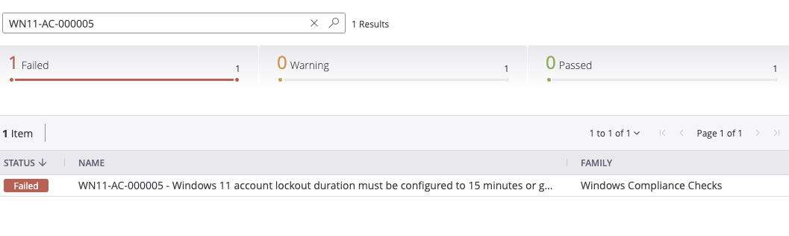

### ✅ Verification Scan — Passed

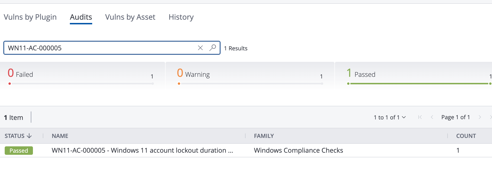

**Result:** ✅ Remediated & Verified

🔧 [View PowerShell Remediation Script](scripts/WN11-AC-000005.ps1)

---

## 4. WN11-AC-000010 — Account Lockout Threshold

**Rule:**  
Windows must limit the number of consecutive failed logon attempts before an account is locked.

**Why It Matters:**  
Limiting failed authentication attempts helps protect accounts against automated password guessing and brute-force attacks.

**Remediation:** PowerShell

### ❌ Initial Scan — Failed

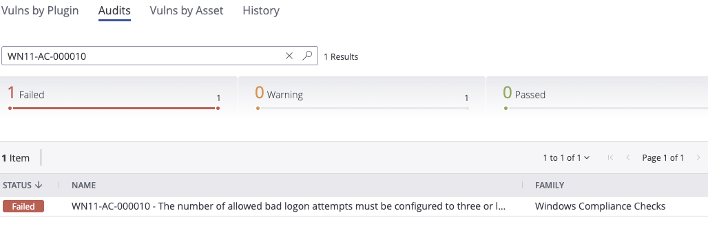

### ✅ Verification Scan — Passed

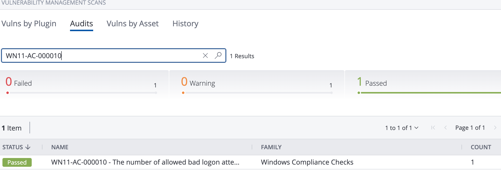

**Result:** ✅ Remediated & Verified

🔧 [View PowerShell Remediation Script](scripts/WN11-AC-000010.ps1)

---

## 5. WN11-AC-000015 — Account Lockout Counter Reset

**Rule:**  
Windows must reset the failed logon attempt counter according to the required account lockout policy.

**Why It Matters:**  
Properly resetting the failed-attempt counter supports consistent account lockout enforcement and reduces exposure to repeated password-guessing attempts.

**Remediation:** PowerShell

### ❌ Initial Scan — Failed

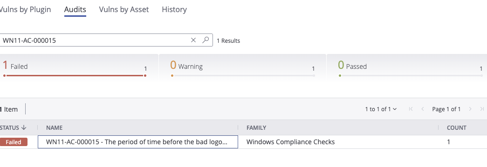

### ✅ Verification Scan — Passed

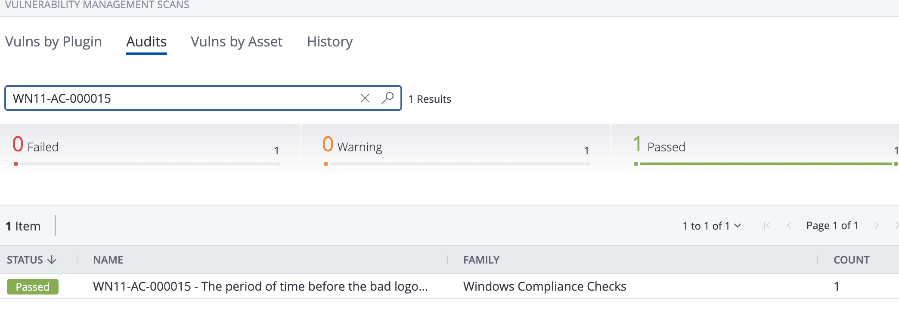

**Result:** ✅ Remediated & Verified

🔧 [View PowerShell Remediation Script](scripts/WN11-AC-000015.ps1)

---

## 6. WN11-AC-000035 — Minimum Password Length

**Rule:**  
Windows passwords must meet the minimum password length required by the DISA STIG.

**Why It Matters:**  
Longer passwords increase resistance to password guessing, brute-force attacks, and password cracking.

**Remediation:** PowerShell

### ❌ Initial Scan — Failed

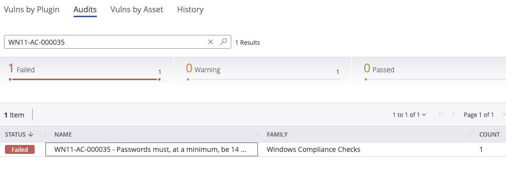

### ✅ Verification Scan — Passed

**Result:** ✅ Remediated & Verified

🔧 [View PowerShell Remediation Script](scripts/WN11-AC-000035.ps1)

---

## 7. WN11-AC-000040 — Password Complexity

**Rule:**  
Windows password complexity requirements must be enabled.

**Why It Matters:**  
Password complexity requirements make weak and easily guessed passwords more difficult to use, improving resistance to credential-based attacks.

**Remediation:** PowerShell

### ❌ Initial Scan — Failed

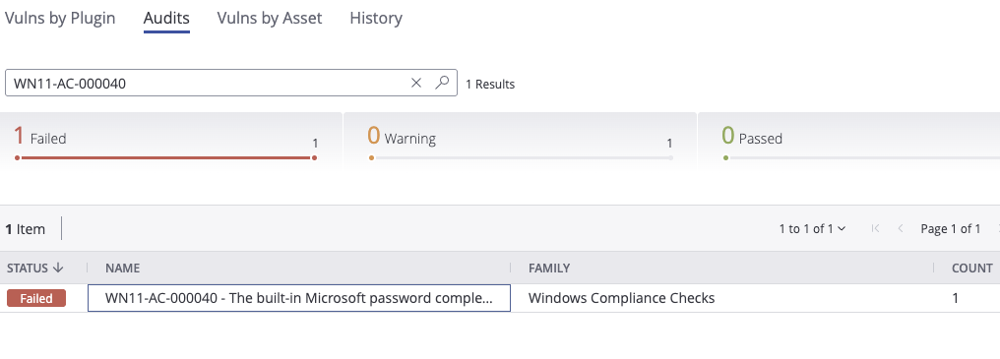

### ✅ Verification Scan — Passed

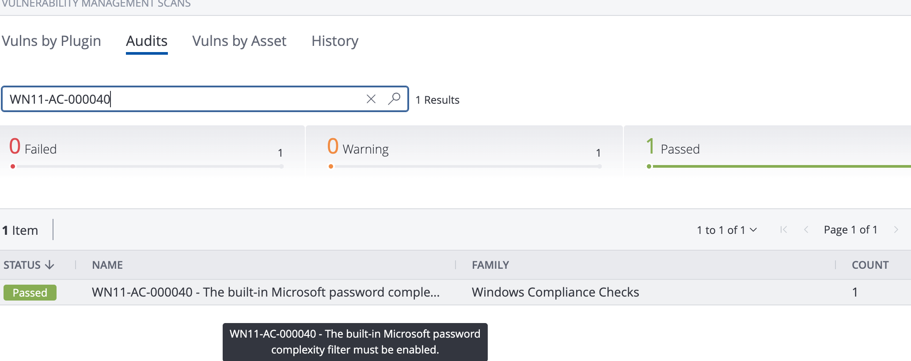

**Result:** ✅ Remediated & Verified

🔧 [View PowerShell Remediation Script](scripts/WN11-AC-000040.ps1)

---

## 8. WN11-CC-000270 — Remote Desktop Credential Protection

**Rule:**  
Windows Remote Desktop sessions must be configured to prevent unnecessary exposure of user credentials.

**Why It Matters:**  
Protecting credentials during remote sessions reduces the risk of credentials being exposed or reused if a remote system is compromised.

**Remediation:** PowerShell

### ❌ Initial Scan — Failed

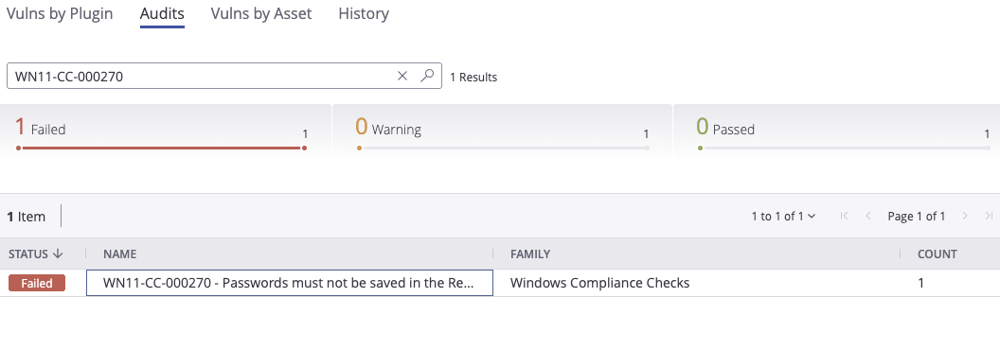

### ✅ Verification Scan — Passed

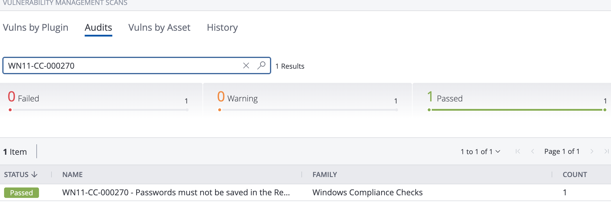

**Result:** ✅ Remediated & Verified

🔧 [View PowerShell Remediation Script](scripts/WN11-CC-000270.ps1)

---

## 9. WN11-SO-000100 — SMB Client Signing

**Rule:**  
The Windows SMB client must be configured to require digitally signed communications.

**Why It Matters:**  
SMB signing helps protect SMB communications against tampering and man-in-the-middle attacks by verifying the integrity and authenticity of SMB traffic.

**Remediation:** PowerShell

### ❌ Initial Scan — Failed

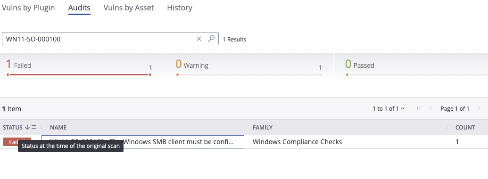

### ✅ Verification Scan — Passed

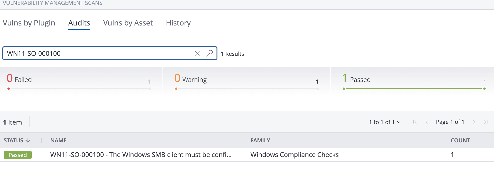

**Result:** ✅ Remediated & Verified

🔧 [View PowerShell Remediation Script](scripts/WN11-SO-000100.ps1)

---

## 10. WN11-SO-000205 — NTLMv2 / Legacy Authentication Hardening

**Rule:**  
Windows LAN Manager authentication must be configured to use NTLMv2 and prevent the use of weaker legacy authentication protocols.

**Why It Matters:**  
Restricting legacy LM and NTLM authentication reduces exposure to credential interception, relay, and password-cracking attacks associated with older authentication protocols.

**Remediation:** PowerShell

### ❌ Initial Scan — Failed

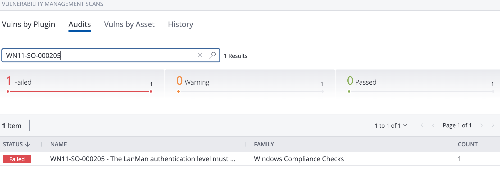

### ✅ Verification Scan — Passed

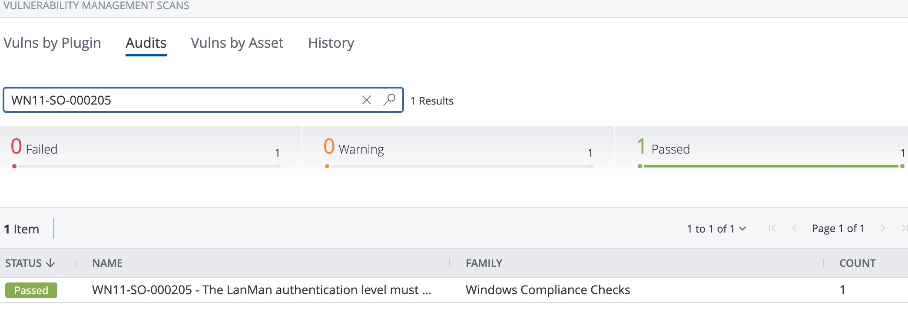

**Result:** ✅ Remediated & Verified

🔧 [View PowerShell Remediation Script](scripts/WN11-SO-000205.ps1)

---

# 🛠️ Technologies & Skills Demonstrated

- DISA STIG implementation
- Tenable Vulnerability Management
- Vulnerability remediation
- PowerShell scripting
- Windows 11 security hardening
- Registry configuration
- Local Security Policy
- Group Policy
- Remediation validation
- Security control verification

---

## Project Summary

This project demonstrates a complete vulnerability remediation lifecycle:

**Identify → Analyze → Remediate → Rescan → Verify**

Rather than only identifying security findings, each selected STIG was remediated and validated through follow-up scanning to confirm that the system configuration met the required security control.
